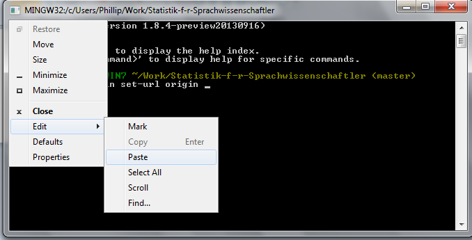
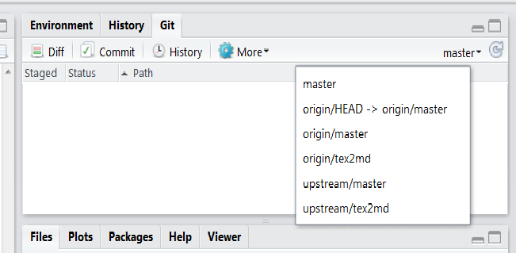

% Setting up Git with RStudio
% Phillip M. Alday
% 2014-04-23    

# Preliminaries
1. Install [Git](http://git-scm.com/), [R](http://www.r-project.org/), and [RStudio](http://www.rstudio.com/)
2. Get an account at [GitHub](https://github.com/). Your GitHub username is left up to you.
3. Log in to GitHub, go to the [course repository](https://github.com/Uni-Marburg-IGS-Statistik/Statistik-f-r-Sprachwissenschaftler), and click **Fork**. If you want a private fork without paying for anything, then you will have to apply for an academic discount. I actively encourage cooperation and code-sharing for the homeworks, so I encourage you to leave your fork public, but this is your choice.
4. If you have a private fork, you must grant me (username `palday`) access to the repository so that I can review the homework.

# Clone the course repository
1. Get the clone URL from course webpage -- in the box, bottom right. The https URL will do, because you won't be making any changes to the course repository.
2. Use RStudio to make a local clone (complete copy!) of the course repository: File > New Project > Version Control > Git. The URL is the clone URL from step 1.

# Set up SSH 
The folks at GitHub have [an excellent guide](https://help.github.com/articles/generating-ssh-keys), but I have a few small tips.

- There is a Linux / OS X / Window specific version of the guide -- make sure to click on the right link at the top!
- You can get to the terminal / GitBash / command line window from inside RStudio:
  
    
  
    On OS X and Linux, this will be the normal command line, on Windows, this is the GitBash commandline, which is included with Git to emulate some Unix features.

- If you get error message `Could not open a connection to your authentication agent` when running `ssh-add`, then you may need to start the agent. The command for this is:
``` 
eval `ssh-agent -s`
```

- Copy and paste for Windows users in GitBash is unfortunately a little bit weird. If you click on the upper left corner of the window (the icon next to the window title text), you get a drop down menu, where you can select copy and paste:

    
    
# Change your origin
Git keeps track of what other computers you are sychronising with via *remotes*. One remote, *origin* is special and the default for all operations where no remote is specified (which are most operations when you use Git inside of RStudio instead of from the command line). If you cloned from the course repository, then your origin is currently set that URL. We need to change that to your repository.

(GitHub also has an introduction to the more general technique of [changing existing remotes](https://help.github.com/articles/changing-a-remote-s-url), which also appears as a link at the bottom of the SSH guide.)

1. Get the clone URL from the webpage for your fork -- in the box, bottom right. You want the ssh URL to make pushing easier. If you accidentally copy the course repository URL (pay attention to the top of the page -- the owner of the repository comes before the name!), then you will get an error message later. For obvious reasons, you do not have the necessary permissions to push to the course repository.
2. Open the command line window again. Your current directory will be displayed as part of the prompt 
  - If you open it new, then you will automatically be in the correct directory. 
  - If you still have the old window (from setting up SSH) open, you can return to the previous directory with the command `cd -`. If the only previous `cd` command you've used was `cd ~/.ssh`, then this will get you to the right place. Otherwise, just close the window and open a new one from RStudio.
3. Change the URL with the following command, making sure to replace the URL with yours[^1] from step 1.
``` 
git remote set-url origin git@github.com:XXX/Statistik-f-r-Sprachwissenschaftler.git
``` 
  4
4. Try pushing -- if everything goes well, you'll either get a notification of pushed branches or a message that everything is up-to-date. You may get the following warning about RSA fingerprint.

  

  I'll quote the GitHub team:
  
  > Don't worry! This is supposed to happen. Verify that the fingerprint in your ~~terminal~~ window matches the one we've provided up above, and then type "yes."
   
   The IP-Address (the numbers in parantheses following `github.com` may be different, but the RSA fingerpint **must** match.)

# Add the course repository as another remote
It turns out that sychronizing with the parent repository via the website is not as easy as I had thought. We can still do this easy -- I promise! -- via the command line by adding another remote. Another term for parent repository or original code source in general is *upstream*  (think of code as a river -- your fork diverges from the upstream), and so we'll use that as the name for our new remote.

1. Open the shell  again if you've already closed the window.
2. Enter the following command:
```
git remote add upstream https://github.com/Uni-Marburg-IGS-Statistik/Statistik-f-r-Sprachwissenschaftler.git
```
     

     You should be able to see the structure of git commands by now:
```
git subsystem [[subcommand]] [[arguments]]
```
     So here, we're telling the system that keeps track of remotes to **add** a new one with a certain name (upstream) and URL.

    Don't fear the command line! It may look scary at first, but it is *very* powerful. Just like with any magic, it takes time to learn the proper incantations (*Zaubersprüche*)!

3. Test that everything worked by pulling in the latest changes:
```
git pull upstream master
```

   Git will automatically merge in most changes, assuming we haven't edited the same spot in the same file. The magic and beauty of this will become clearer as the semester progresses.

Unfortunately, there doesn't seem to be a particularly good way to do this via RStudio's graphical interface, so you'll need to open a shell window to pull the changes in the course repository to your own. Pushing and pulling to origin, i.e. your repository, works wonderfully via the pull and push buttons in RStudio. The next time you push to your repository, the changes from upstream will be included! 

## Only for the curious, don't worry if it's a bit confusing right now! Feel free to skip!
If you're really curious, you can actually look at the different branches Git is keeping track of by clicking on the word "master" in RStudio:



Branches are a bit like forks that can exist in the same repository. The list there shows that Git is keeping track of the branches on certain remotes and locally (the remote name prefixes the branch name). Your local branch *tracks* the changes in other branches -- it will sychronize them when requested, but not before! "master" is the special, default branch -- i.e. the "master copy" from which everything else descends.

[^1]: If you look closely, you'll notice that you could also just change the XXX to your username on GitHub  