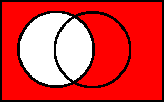
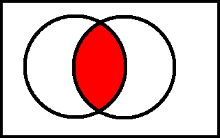
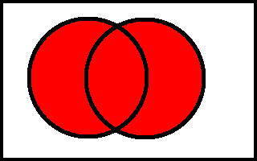
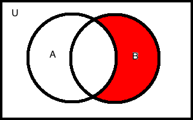
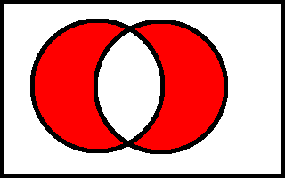

Basic Idea
==========

A **set** is a well-defined collection of objects, called
**elements**. The following are all sets:

$$\begin{gathered}
\left\{ \text{apple}, \text{grape}, \text{orange}, \text{banana} \right\} \\
\left\{ \checkmark{}, \maltese{}, \dag{}, \S,  \right\} \\
\left\{ w, x, y, z \right\}\end{gathered}$$

Sets can also be elements of another set -- it is possible to have a set
of sets:

$$\left\{ \left\{a,b,c \right\}, \left\{w,x,y,z\right\}, \left\{ \alpha, \beta \right\} \right\}$$

Some sets are so important that they have a fixed symbol:

$$\begin{gathered}
\emptyset = \left\{ \right\} \\
\mathbb{N} = \left\{(0), 1, 2, 3, \ldots \right\} \\ \mathbb{Z}= \left\{\ldots, -3, -2, -1, 0, 1, 2, 3, \ldots \right\} \\
\mathbb{Q} = \left\{\frac{p}{q} : p,q \in \mathbb{Z}, q \neq 0 \right\} \\\end{gathered}$$

Operations on Sets
==================

For the following, let $A,B, U$ be sets such that $A, B \subset U$.

Equality of Sets
----------------

Two sets $A, B$ are said to be equal if and only if they
have the same elements. That is:

$$A = B \Longleftrightarrow \forall a \in A, a \in B \text{ and } \forall b \in B, b \in A$$

Sub- and Supersets
------------------

A set $A$ is said to be a subset of a set $B$, if every
element of $A$ is also in $B$:

$$A \subset B \Longleftrightarrow \forall a \in A, a \in B$$

Correspondingly, $B$ is said to be a superset of $A$.

Please note that a set is a subset of itself and a superset of itself
according to these definitions. If we do not wish to include the
original set itself when discussing subsets and supersets, we use the
modifier proper.

Complement
----------

r3cm

[fig:sets-complement]

The complement of $A$ in $U$ is the set of elements in $U$
but not in $A$. That is:

$$A^{c} = \left\{ x \in U : x \not\in A \right\}$$

Please note: set complement requires the context of another set!

Intersection
------------

r3cm 

[fig:sets-intersection]

The intersection of $A$ and $B$ is the set of elements in
both $A$ and $B$. That is:

$$A \cap B = \left\{x: x \in A \text{ and } x \in B \right\}$$

This is, roughly, the overlap between the two sets.

Union
-----

r3cm 

[fig:sets-union]

The union of $A$ and $B$ is the set such that each element
is in $A$ or is in $B$ (or both):

$$\label{eq:uniondef}
A \cup B = \left\{x: x \in A \text{ or } x \in B \right\}$$

This is roughly the set you get from combining $A$ and $B$. Please note:
this does not double any elements already found in both sets (the
intersection); if any doubt, use the formal definition ([eq:uniondef])!

Difference (Relative Complement)
--------------------------------

r3cm 

[fig:sets-difference]

The difference of $B$ and $A$ is the set of elements in $B$
but not in $A$:

$$B \setminus A = \left\{ x \in B, x \not\in A\right\}$$

This is roughly the set you get from cutting out $A$ from $B$. The
$\setminus$ symbol even looks a little bit like a cutting implement …

Disjoint Union
--------------

r3cm

[fig:sets-disjointunion]

The disjoint union of $A$ and $B$ is the set of elements
either in $A$ or in $B$, but not both:

$$A \sqcup B = \left\{x: x\in A \text{ xor } x \in B\right\}$$

This is roughly the parts of $A$ and $B$ which don’t have any overlap.

Size (Cardinality)
==================

The cardinality of a set corresponds to the intuitive
notion of “size”: the number of elements in a set. For example,

$$\begin{gathered}
\left| \emptyset \right| =  0 \\
\left| \left\{ 1 \right\} \right| = 1 \\
\left| \left\{ 1, 2 \right\} \right| =  2 \\
\left| \left\{ \checkmark{}, \maltese{}, \dag{}, \S,  \right\} \right| =  4 \\
\left| \left\{ 1, 2, \ldots, 100 \right\} \right| =  100 \\
\left| \left\{ 1, 2, \ldots, n \right\} \right| = n\label{eq:card-n}  \\
\left| \mathbb{N} \right| = ?    \end{gathered}$$

As we can see, this is pretty easy for finite sets, even arbitrarily
large ones.[^1] But what happens if we want to measure the size of
infinite sets? As it turns out, there are different infinities. Broadly
speaking, there are two major types of infinity. Countably
infinite sets can be enumerated or counted in the same way as the
natural numbers: if we had infinitely much time, we could count them off
one by one, in much the same way as we can start counting from one and
keep going forever.[^2]. The integers ($\mathbb{Z}$) are also countable,
we count them off like so: $0, 1, -1, 2, -2, 3, -3, \ldots$.[^3]

In contrast to the integers, we can’t count off the reals
($\mathbb{R}$). If we start with 1, we can’t say what comes next: 1.1?
1.01? 1.001? 1.0001? We can always add another zero: the reals are a
continuum. This type of infinity is somehow different and intuitively
“bigger”. Indeed, the countable subsets of the reals are all proper
subsets, and so we can somehow say that uncountable infinity is somehow
“bigger” than the countable ones.

But here is also a good time to note that things are a little bit weird
when dealing with infinity. The natural numbers are a proper subset of
the integers, yet they are both countably infinite, which means they
both have the same size in some sense. Similar things can happen with
uncountable infinities: the closed interval $\left[0,1\right]$ can be
used to represent all real numbers without “losing” any.[^4] This fact
is frequently used in optimality theory and computational linguistics as
well as probability and statistics. A weight or a probability or any
other type of scaling factor is typically represented as a number
between 0 and 1, inclusive. Resolving this weirdness is well beyond the
scope of this introduction, but the lesson here is simple: be wary of
doing “normal” things around infinity or treating it like a number,
because it’s not.

Exercises
=========

1.  Restate the disjoint union operation in terms of intersections and
    unions.

2.  Give a formula for $|A \cup{} B|$ in terms of $A,B$ and other basic
    operations on them.

3.  Is the union of two countable sets also countable?

4.  What are the cardinalities of the following sets?

    1.  { the numbers between 218 and 527, inclusive }

    2.  { distinct rearrangements of the letters in “Dana” }

[^1]: It is very important to realize that “arbitrarily large” is not
    the same as “infinite”. Equation ([eq:card-n]) shows this: this
    works for any natural number (of which there are infinitely many),
    but does not work for the truly infinite case.

[^2]: Formally, an infinite set $X$ has countably many elements if there
    exists a bijection (a one-to-one and onto function) between $X$ and
    $\mathbb{N}$

[^3]: Challenge question: What would this bijection look like formally?

[^4]: The easiest example of how a finite interval can be mapped onto
    the entire real line is provided by high school trigonometry. The
    tangent function provides a bijection between the open interval
    $(-\pi,\pi)$ and $(-\infty, \infty)$, so the two sets are also
    somehow the same “size”.
