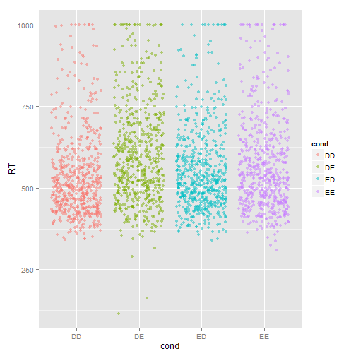
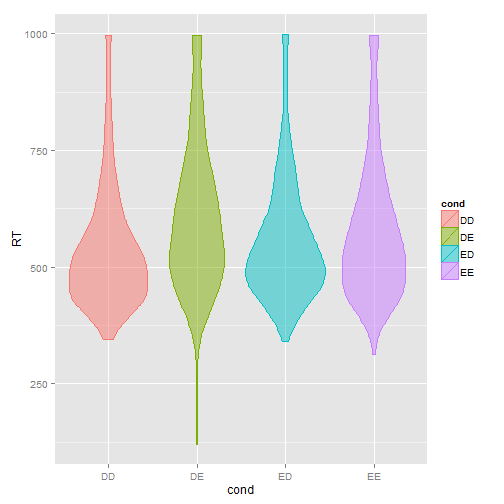
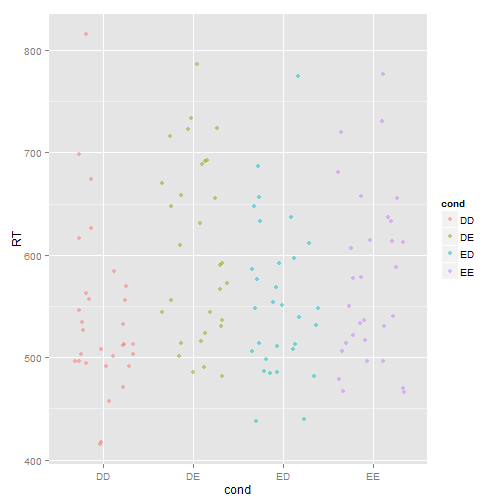

% Hausaufgabe 13
% Corinna Schwarz <co-schwarz@web.de>
% 2014-05-28

Falls die Umlaute in dieser und anderen Dateien nicht korrekt dargestellt werden, sollten Sie File > Reopen with Encoding > UTF-8 sofort machen (und auf jeden Fall ohne davor zu speichern), damit die Enkodierung korrekt erkannt wird! 


# Die nächsten Punkte sollten langsam automatisch sein...
1. Kopieren Sie diese Datei in Ihren Ordner (das können Sie innerhalb RStudio machen oder mit Explorer/Finder/usw.) und öffnen Sie die Kopie. Ab diesem Punkt arbeiten Sie mit der Kopie. Die Kopie bitte `hausaufgabe13.Rmd` nennen und nicht `Kopie...`
2. Sie sehen jetzt im Git-Tab, dass der neue Ordner als unbekannt (mit gelbem Fragezeichen) da steht. Geben Sie Git Bescheid, dass Sie die Änderungen im Ordner verfolgen möchten (auf Stage klicken). Die neue Datei steht automatisch da.
3. Machen Sie ein Commit mit den bisherigen Änderungen (schreiben Sie eine sinnvolle Message dazu -- sinnvoll bedeutet nicht unbedingt lang) und danach einen Push.
4. Ersetzen Sie meinen Namen oben mit Ihrem. Klicken auf Stage, um die Änderung zu merken.
5. Ändern Sie das Datum auf heute. (Seien Sie ehrlich! Ich kann das sowieso am Commit sehen.)
6. Sie sehen jetzt, dass es zwei Symbole in der Status-Spalte gibt, eins für den Zustand im *Staging Area* (auch als *Index* bekannt), eins für den Zustand im Vergleich zum Staging Area. Sie haben die Datei modifiziert, eine Änderung in das Staging Area aufgenommen, und danach weitere Änderungen gemacht. Nur Änderungen im Staging Area werden in den Commit aufgenommen.
7. Stellen Sie die letzten Änderungen auch ins Staging Area und machen Sie einen Commit (immer mit sinnvoller Message!).
8. Vergessen Sie nicht am Ende, die Lizenz ggf. zu ändern!

Um einiges leichter zu machen, sollten Sie auch die Datei `priming.tab` aus dem Data-Ordner kopieren, stagen und commiten. Sie müssen ggf. Ihr Arbeitsverzeichnis setzen, wenn R die .tab-Datei nicht finden kann: Session > Set Working Directory > Source File Location

# Beschreibung des Experiments
- Aufgabe: Lexikalische Entscheidung 
- Abhängige Variable: Reaktionszeit, gemessen in Millisekunden (ms)
- Bedingungen (2 x 2)
    - `prime`: Englisch, Deutsch
    - `target`: Englisch, Deutsch
- Wiederholungen
    - Probanden `subj` ($n_1 = 30$)
    - Items `item` ($n_2=20$)

30 Subjects x 20 Items x 8 Bedingungen = 4800 Trials.

```r
priming <- read.table("priming.tab", header = T)
priming$subj <- as.factor(priming$subj)
priming <- subset(priming, item <= 20)  # Filler ausschließen
priming$item <- as.factor(priming$item)
```


## Darstellung der Daten ohne Berücksichtigung der Wiederholungen

```r
ggplot(data = priming) + geom_density(aes(x = RT, color = cond, fill = cond), 
    alpha = 0.3)
```

 


```r
ggplot(data = priming) + geom_jitter(aes(x = cond, y = RT, color = cond, fill = cond), 
    alpha = 0.5)
```

 


```r
ggplot(data = priming) + geom_violin(aes(x = cond, y = RT, color = cond, fill = cond), 
    alpha = 0.5)
```

 


```r
ggplot(data = priming) + geom_boxplot(aes(x = cond, y = RT, color = cond, fill = cond), 
    alpha = 0.5)
```

 


## Darstellung der Daten mit Berücksichtigung der Wiederholungen
Wenn wir naiv die Wiederholungen betrachten, können wir uns entweder auf den zufälligen Faktor **Subject** oder den zufälligen Faktor **Item** dadurch konzentrien, dass wir die Mittelwerte berechnen. 

### By Subject
Bei "Subject" berechnen wir die Mittelwerte aller Trials innerhalb einer Versuchsperson, d.h. wir nehmen den versuchpersonenweise Mittelwert über Items hinweg. Dafür können wir `aggregate()` nutzen.

```r
priming.by.subject <- aggregate(RT ~ cond * subj, data = priming, FUN = mean)
```


Wir können die Tabelle, die durch entsteht, mit `xtable()` schön drucken. Bemerken Sie dabei, dass wir eine weitere Option (`results='asis'`) beim Code-Block setzen müssen!

```r
print(xtable(priming.by.subject), type = "html", include.rownames = FALSE)
```

<!-- html table generated in R 3.1.0 by xtable 1.7-3 package -->
<!-- Wed May 28 14:19:44 2014 -->
<TABLE border=1>
<TR> <TH> cond </TH> <TH> subj </TH> <TH> RT </TH>  </TR>
  <TR> <TD> DD </TD> <TD> 1 </TD> <TD align="right"> 569.75 </TD> </TR>
  <TR> <TD> DE </TD> <TD> 1 </TD> <TD align="right"> 655.15 </TD> </TR>
  <TR> <TD> ED </TD> <TD> 1 </TD> <TD align="right"> 592.00 </TD> </TR>
  <TR> <TD> EE </TD> <TD> 1 </TD> <TD align="right"> 587.70 </TD> </TR>
  <TR> <TD> DD </TD> <TD> 2 </TD> <TD align="right"> 512.95 </TD> </TR>
  <TR> <TD> DE </TD> <TD> 2 </TD> <TD align="right"> 536.65 </TD> </TR>
  <TR> <TD> ED </TD> <TD> 2 </TD> <TD align="right"> 481.20 </TD> </TR>
  <TR> <TD> EE </TD> <TD> 2 </TD> <TD align="right"> 530.85 </TD> </TR>
  <TR> <TD> DD </TD> <TD> 3 </TD> <TD align="right"> 503.15 </TD> </TR>
  <TR> <TD> DE </TD> <TD> 3 </TD> <TD align="right"> 609.80 </TD> </TR>
  <TR> <TD> ED </TD> <TD> 3 </TD> <TD align="right"> 508.40 </TD> </TR>
  <TR> <TD> EE </TD> <TD> 3 </TD> <TD align="right"> 549.50 </TD> </TR>
  <TR> <TD> DD </TD> <TD> 4 </TD> <TD align="right"> 616.45 </TD> </TR>
  <TR> <TD> DE </TD> <TD> 4 </TD> <TD align="right"> 648.05 </TD> </TR>
  <TR> <TD> ED </TD> <TD> 4 </TD> <TD align="right"> 633.35 </TD> </TR>
  <TR> <TD> EE </TD> <TD> 4 </TD> <TD align="right"> 577.60 </TD> </TR>
  <TR> <TD> DD </TD> <TD> 5 </TD> <TD align="right"> 698.45 </TD> </TR>
  <TR> <TD> DE </TD> <TD> 5 </TD> <TD align="right"> 733.50 </TD> </TR>
  <TR> <TD> ED </TD> <TD> 5 </TD> <TD align="right"> 656.10 </TD> </TR>
  <TR> <TD> EE </TD> <TD> 5 </TD> <TD align="right"> 681.15 </TD> </TR>
  <TR> <TD> DD </TD> <TD> 6 </TD> <TD align="right"> 562.75 </TD> </TR>
  <TR> <TD> DE </TD> <TD> 6 </TD> <TD align="right"> 723.60 </TD> </TR>
  <TR> <TD> ED </TD> <TD> 6 </TD> <TD align="right"> 611.25 </TD> </TR>
  <TR> <TD> EE </TD> <TD> 6 </TD> <TD align="right"> 730.25 </TD> </TR>
  <TR> <TD> DD </TD> <TD> 7 </TD> <TD align="right"> 584.60 </TD> </TR>
  <TR> <TD> DE </TD> <TD> 7 </TD> <TD align="right"> 657.90 </TD> </TR>
  <TR> <TD> ED </TD> <TD> 7 </TD> <TD align="right"> 586.05 </TD> </TR>
  <TR> <TD> EE </TD> <TD> 7 </TD> <TD align="right"> 655.30 </TD> </TR>
  <TR> <TD> DD </TD> <TD> 8 </TD> <TD align="right"> 546.15 </TD> </TR>
  <TR> <TD> DE </TD> <TD> 8 </TD> <TD align="right"> 715.65 </TD> </TR>
  <TR> <TD> ED </TD> <TD> 8 </TD> <TD align="right"> 596.95 </TD> </TR>
  <TR> <TD> EE </TD> <TD> 8 </TD> <TD align="right"> 612.90 </TD> </TR>
  <TR> <TD> DD </TD> <TD> 9 </TD> <TD align="right"> 457.35 </TD> </TR>
  <TR> <TD> DE </TD> <TD> 9 </TD> <TD align="right"> 490.55 </TD> </TR>
  <TR> <TD> ED </TD> <TD> 9 </TD> <TD align="right"> 437.90 </TD> </TR>
  <TR> <TD> EE </TD> <TD> 9 </TD> <TD align="right"> 470.35 </TD> </TR>
  <TR> <TD> DD </TD> <TD> 10 </TD> <TD align="right"> 496.60 </TD> </TR>
  <TR> <TD> DE </TD> <TD> 10 </TD> <TD align="right"> 515.85 </TD> </TR>
  <TR> <TD> ED </TD> <TD> 10 </TD> <TD align="right"> 505.60 </TD> </TR>
  <TR> <TD> EE </TD> <TD> 10 </TD> <TD align="right"> 533.25 </TD> </TR>
  <TR> <TD> DD </TD> <TD> 11 </TD> <TD align="right"> 496.35 </TD> </TR>
  <TR> <TD> DE </TD> <TD> 11 </TD> <TD align="right"> 513.65 </TD> </TR>
  <TR> <TD> ED </TD> <TD> 11 </TD> <TD align="right"> 513.65 </TD> </TR>
  <TR> <TD> EE </TD> <TD> 11 </TD> <TD align="right"> 516.40 </TD> </TR>
  <TR> <TD> DD </TD> <TD> 12 </TD> <TD align="right"> 556.10 </TD> </TR>
  <TR> <TD> DE </TD> <TD> 12 </TD> <TD align="right"> 691.20 </TD> </TR>
  <TR> <TD> ED </TD> <TD> 12 </TD> <TD align="right"> 636.55 </TD> </TR>
  <TR> <TD> EE </TD> <TD> 12 </TD> <TD align="right"> 637.25 </TD> </TR>
  <TR> <TD> DD </TD> <TD> 13 </TD> <TD align="right"> 491.45 </TD> </TR>
  <TR> <TD> DE </TD> <TD> 13 </TD> <TD align="right"> 591.85 </TD> </TR>
  <TR> <TD> ED </TD> <TD> 13 </TD> <TD align="right"> 531.15 </TD> </TR>
  <TR> <TD> EE </TD> <TD> 13 </TD> <TD align="right"> 613.65 </TD> </TR>
  <TR> <TD> DD </TD> <TD> 14 </TD> <TD align="right"> 556.90 </TD> </TR>
  <TR> <TD> DE </TD> <TD> 14 </TD> <TD align="right"> 688.45 </TD> </TR>
  <TR> <TD> ED </TD> <TD> 14 </TD> <TD align="right"> 576.15 </TD> </TR>
  <TR> <TD> EE </TD> <TD> 14 </TD> <TD align="right"> 614.25 </TD> </TR>
  <TR> <TD> DD </TD> <TD> 15 </TD> <TD align="right"> 417.20 </TD> </TR>
  <TR> <TD> DE </TD> <TD> 15 </TD> <TD align="right"> 544.25 </TD> </TR>
  <TR> <TD> ED </TD> <TD> 15 </TD> <TD align="right"> 498.40 </TD> </TR>
  <TR> <TD> EE </TD> <TD> 15 </TD> <TD align="right"> 466.40 </TD> </TR>
  <TR> <TD> DD </TD> <TD> 16 </TD> <TD align="right"> 526.90 </TD> </TR>
  <TR> <TD> DE </TD> <TD> 16 </TD> <TD align="right"> 566.30 </TD> </TR>
  <TR> <TD> ED </TD> <TD> 16 </TD> <TD align="right"> 539.10 </TD> </TR>
  <TR> <TD> EE </TD> <TD> 16 </TD> <TD align="right"> 505.70 </TD> </TR>
  <TR> <TD> DD </TD> <TD> 17 </TD> <TD align="right"> 502.75 </TD> </TR>
  <TR> <TD> DE </TD> <TD> 17 </TD> <TD align="right"> 571.95 </TD> </TR>
  <TR> <TD> ED </TD> <TD> 17 </TD> <TD align="right"> 548.05 </TD> </TR>
  <TR> <TD> EE </TD> <TD> 17 </TD> <TD align="right"> 577.80 </TD> </TR>
  <TR> <TD> DD </TD> <TD> 18 </TD> <TD align="right"> 470.75 </TD> </TR>
  <TR> <TD> DE </TD> <TD> 18 </TD> <TD align="right"> 485.05 </TD> </TR>
  <TR> <TD> ED </TD> <TD> 18 </TD> <TD align="right"> 485.65 </TD> </TR>
  <TR> <TD> EE </TD> <TD> 18 </TD> <TD align="right"> 478.25 </TD> </TR>
  <TR> <TD> DD </TD> <TD> 19 </TD> <TD align="right"> 626.45 </TD> </TR>
  <TR> <TD> DE </TD> <TD> 19 </TD> <TD align="right"> 722.90 </TD> </TR>
  <TR> <TD> ED </TD> <TD> 19 </TD> <TD align="right"> 686.90 </TD> </TR>
  <TR> <TD> EE </TD> <TD> 19 </TD> <TD align="right"> 657.55 </TD> </TR>
  <TR> <TD> DD </TD> <TD> 20 </TD> <TD align="right"> 815.25 </TD> </TR>
  <TR> <TD> DE </TD> <TD> 20 </TD> <TD align="right"> 785.95 </TD> </TR>
  <TR> <TD> ED </TD> <TD> 20 </TD> <TD align="right"> 774.10 </TD> </TR>
  <TR> <TD> EE </TD> <TD> 20 </TD> <TD align="right"> 777.00 </TD> </TR>
  <TR> <TD> DD </TD> <TD> 21 </TD> <TD align="right"> 673.60 </TD> </TR>
  <TR> <TD> DE </TD> <TD> 21 </TD> <TD align="right"> 692.50 </TD> </TR>
  <TR> <TD> ED </TD> <TD> 21 </TD> <TD align="right"> 647.15 </TD> </TR>
  <TR> <TD> EE </TD> <TD> 21 </TD> <TD align="right"> 719.55 </TD> </TR>
  <TR> <TD> DD </TD> <TD> 22 </TD> <TD align="right"> 534.50 </TD> </TR>
  <TR> <TD> DE </TD> <TD> 22 </TD> <TD align="right"> 544.05 </TD> </TR>
  <TR> <TD> ED </TD> <TD> 22 </TD> <TD align="right"> 512.50 </TD> </TR>
  <TR> <TD> EE </TD> <TD> 22 </TD> <TD align="right"> 513.60 </TD> </TR>
  <TR> <TD> DD </TD> <TD> 23 </TD> <TD align="right"> 532.80 </TD> </TR>
  <TR> <TD> DE </TD> <TD> 23 </TD> <TD align="right"> 631.10 </TD> </TR>
  <TR> <TD> ED </TD> <TD> 23 </TD> <TD align="right"> 568.40 </TD> </TR>
  <TR> <TD> EE </TD> <TD> 23 </TD> <TD align="right"> 633.40 </TD> </TR>
  <TR> <TD> DD </TD> <TD> 24 </TD> <TD align="right"> 513.20 </TD> </TR>
  <TR> <TD> DE </TD> <TD> 24 </TD> <TD align="right"> 669.75 </TD> </TR>
  <TR> <TD> ED </TD> <TD> 24 </TD> <TD align="right"> 548.20 </TD> </TR>
  <TR> <TD> EE </TD> <TD> 24 </TD> <TD align="right"> 606.65 </TD> </TR>
  <TR> <TD> DD </TD> <TD> 25 </TD> <TD align="right"> 491.65 </TD> </TR>
  <TR> <TD> DE </TD> <TD> 25 </TD> <TD align="right"> 556.10 </TD> </TR>
  <TR> <TD> ED </TD> <TD> 25 </TD> <TD align="right"> 486.00 </TD> </TR>
  <TR> <TD> EE </TD> <TD> 25 </TD> <TD align="right"> 521.85 </TD> </TR>
  <TR> <TD> DD </TD> <TD> 26 </TD> <TD align="right"> 415.60 </TD> </TR>
  <TR> <TD> DE </TD> <TD> 26 </TD> <TD align="right"> 523.25 </TD> </TR>
  <TR> <TD> ED </TD> <TD> 26 </TD> <TD align="right"> 439.85 </TD> </TR>
  <TR> <TD> EE </TD> <TD> 26 </TD> <TD align="right"> 496.10 </TD> </TR>
  <TR> <TD> DD </TD> <TD> 27 </TD> <TD align="right"> 500.70 </TD> </TR>
  <TR> <TD> DE </TD> <TD> 27 </TD> <TD align="right"> 500.65 </TD> </TR>
  <TR> <TD> ED </TD> <TD> 27 </TD> <TD align="right"> 550.95 </TD> </TR>
  <TR> <TD> EE </TD> <TD> 27 </TD> <TD align="right"> 536.40 </TD> </TR>
  <TR> <TD> DD </TD> <TD> 28 </TD> <TD align="right"> 494.65 </TD> </TR>
  <TR> <TD> DE </TD> <TD> 28 </TD> <TD align="right"> 481.60 </TD> </TR>
  <TR> <TD> ED </TD> <TD> 28 </TD> <TD align="right"> 511.10 </TD> </TR>
  <TR> <TD> EE </TD> <TD> 28 </TD> <TD align="right"> 466.45 </TD> </TR>
  <TR> <TD> DD </TD> <TD> 29 </TD> <TD align="right"> 507.90 </TD> </TR>
  <TR> <TD> DE </TD> <TD> 29 </TD> <TD align="right"> 590.25 </TD> </TR>
  <TR> <TD> ED </TD> <TD> 29 </TD> <TD align="right"> 553.95 </TD> </TR>
  <TR> <TD> EE </TD> <TD> 29 </TD> <TD align="right"> 539.85 </TD> </TR>
  <TR> <TD> DD </TD> <TD> 30 </TD> <TD align="right"> 512.10 </TD> </TR>
  <TR> <TD> DE </TD> <TD> 30 </TD> <TD align="right"> 530.75 </TD> </TR>
  <TR> <TD> ED </TD> <TD> 30 </TD> <TD align="right"> 484.60 </TD> </TR>
  <TR> <TD> EE </TD> <TD> 30 </TD> <TD align="right"> 496.60 </TD> </TR>
   </TABLE>


Diese Tabelle ist etwas "lang" (ist ja in long format!). Wie könnten sie auch breiter machen mit der Funktion `dcast()` (`cast` für Data Frames) aus dem Paket `reshape2`. 

Mit Versuchspersonen als Zeilen und Bedingungen als Spalten:

```r
priming.by.subject.wide1 <- dcast(priming.by.subject, subj ~ cond, value.var = "RT")
print(xtable(priming.by.subject.wide1), type = "html", include.rownames = FALSE)
```

<!-- html table generated in R 3.1.0 by xtable 1.7-3 package -->
<!-- Wed May 28 14:19:44 2014 -->
<TABLE border=1>
<TR> <TH> subj </TH> <TH> DD </TH> <TH> DE </TH> <TH> ED </TH> <TH> EE </TH>  </TR>
  <TR> <TD> 1 </TD> <TD align="right"> 569.75 </TD> <TD align="right"> 655.15 </TD> <TD align="right"> 592.00 </TD> <TD align="right"> 587.70 </TD> </TR>
  <TR> <TD> 2 </TD> <TD align="right"> 512.95 </TD> <TD align="right"> 536.65 </TD> <TD align="right"> 481.20 </TD> <TD align="right"> 530.85 </TD> </TR>
  <TR> <TD> 3 </TD> <TD align="right"> 503.15 </TD> <TD align="right"> 609.80 </TD> <TD align="right"> 508.40 </TD> <TD align="right"> 549.50 </TD> </TR>
  <TR> <TD> 4 </TD> <TD align="right"> 616.45 </TD> <TD align="right"> 648.05 </TD> <TD align="right"> 633.35 </TD> <TD align="right"> 577.60 </TD> </TR>
  <TR> <TD> 5 </TD> <TD align="right"> 698.45 </TD> <TD align="right"> 733.50 </TD> <TD align="right"> 656.10 </TD> <TD align="right"> 681.15 </TD> </TR>
  <TR> <TD> 6 </TD> <TD align="right"> 562.75 </TD> <TD align="right"> 723.60 </TD> <TD align="right"> 611.25 </TD> <TD align="right"> 730.25 </TD> </TR>
  <TR> <TD> 7 </TD> <TD align="right"> 584.60 </TD> <TD align="right"> 657.90 </TD> <TD align="right"> 586.05 </TD> <TD align="right"> 655.30 </TD> </TR>
  <TR> <TD> 8 </TD> <TD align="right"> 546.15 </TD> <TD align="right"> 715.65 </TD> <TD align="right"> 596.95 </TD> <TD align="right"> 612.90 </TD> </TR>
  <TR> <TD> 9 </TD> <TD align="right"> 457.35 </TD> <TD align="right"> 490.55 </TD> <TD align="right"> 437.90 </TD> <TD align="right"> 470.35 </TD> </TR>
  <TR> <TD> 10 </TD> <TD align="right"> 496.60 </TD> <TD align="right"> 515.85 </TD> <TD align="right"> 505.60 </TD> <TD align="right"> 533.25 </TD> </TR>
  <TR> <TD> 11 </TD> <TD align="right"> 496.35 </TD> <TD align="right"> 513.65 </TD> <TD align="right"> 513.65 </TD> <TD align="right"> 516.40 </TD> </TR>
  <TR> <TD> 12 </TD> <TD align="right"> 556.10 </TD> <TD align="right"> 691.20 </TD> <TD align="right"> 636.55 </TD> <TD align="right"> 637.25 </TD> </TR>
  <TR> <TD> 13 </TD> <TD align="right"> 491.45 </TD> <TD align="right"> 591.85 </TD> <TD align="right"> 531.15 </TD> <TD align="right"> 613.65 </TD> </TR>
  <TR> <TD> 14 </TD> <TD align="right"> 556.90 </TD> <TD align="right"> 688.45 </TD> <TD align="right"> 576.15 </TD> <TD align="right"> 614.25 </TD> </TR>
  <TR> <TD> 15 </TD> <TD align="right"> 417.20 </TD> <TD align="right"> 544.25 </TD> <TD align="right"> 498.40 </TD> <TD align="right"> 466.40 </TD> </TR>
  <TR> <TD> 16 </TD> <TD align="right"> 526.90 </TD> <TD align="right"> 566.30 </TD> <TD align="right"> 539.10 </TD> <TD align="right"> 505.70 </TD> </TR>
  <TR> <TD> 17 </TD> <TD align="right"> 502.75 </TD> <TD align="right"> 571.95 </TD> <TD align="right"> 548.05 </TD> <TD align="right"> 577.80 </TD> </TR>
  <TR> <TD> 18 </TD> <TD align="right"> 470.75 </TD> <TD align="right"> 485.05 </TD> <TD align="right"> 485.65 </TD> <TD align="right"> 478.25 </TD> </TR>
  <TR> <TD> 19 </TD> <TD align="right"> 626.45 </TD> <TD align="right"> 722.90 </TD> <TD align="right"> 686.90 </TD> <TD align="right"> 657.55 </TD> </TR>
  <TR> <TD> 20 </TD> <TD align="right"> 815.25 </TD> <TD align="right"> 785.95 </TD> <TD align="right"> 774.10 </TD> <TD align="right"> 777.00 </TD> </TR>
  <TR> <TD> 21 </TD> <TD align="right"> 673.60 </TD> <TD align="right"> 692.50 </TD> <TD align="right"> 647.15 </TD> <TD align="right"> 719.55 </TD> </TR>
  <TR> <TD> 22 </TD> <TD align="right"> 534.50 </TD> <TD align="right"> 544.05 </TD> <TD align="right"> 512.50 </TD> <TD align="right"> 513.60 </TD> </TR>
  <TR> <TD> 23 </TD> <TD align="right"> 532.80 </TD> <TD align="right"> 631.10 </TD> <TD align="right"> 568.40 </TD> <TD align="right"> 633.40 </TD> </TR>
  <TR> <TD> 24 </TD> <TD align="right"> 513.20 </TD> <TD align="right"> 669.75 </TD> <TD align="right"> 548.20 </TD> <TD align="right"> 606.65 </TD> </TR>
  <TR> <TD> 25 </TD> <TD align="right"> 491.65 </TD> <TD align="right"> 556.10 </TD> <TD align="right"> 486.00 </TD> <TD align="right"> 521.85 </TD> </TR>
  <TR> <TD> 26 </TD> <TD align="right"> 415.60 </TD> <TD align="right"> 523.25 </TD> <TD align="right"> 439.85 </TD> <TD align="right"> 496.10 </TD> </TR>
  <TR> <TD> 27 </TD> <TD align="right"> 500.70 </TD> <TD align="right"> 500.65 </TD> <TD align="right"> 550.95 </TD> <TD align="right"> 536.40 </TD> </TR>
  <TR> <TD> 28 </TD> <TD align="right"> 494.65 </TD> <TD align="right"> 481.60 </TD> <TD align="right"> 511.10 </TD> <TD align="right"> 466.45 </TD> </TR>
  <TR> <TD> 29 </TD> <TD align="right"> 507.90 </TD> <TD align="right"> 590.25 </TD> <TD align="right"> 553.95 </TD> <TD align="right"> 539.85 </TD> </TR>
  <TR> <TD> 30 </TD> <TD align="right"> 512.10 </TD> <TD align="right"> 530.75 </TD> <TD align="right"> 484.60 </TD> <TD align="right"> 496.60 </TD> </TR>
   </TABLE>

 
Mit Bedingungen als Zeilen und Versuchspersonen als Spalten:

```r
priming.by.subject.wide2 <- dcast(priming.by.subject, cond ~ subj, value.var = "RT")
print(xtable(priming.by.subject.wide2), type = "html", include.rownames = FALSE)
```

<!-- html table generated in R 3.1.0 by xtable 1.7-3 package -->
<!-- Wed May 28 14:19:44 2014 -->
<TABLE border=1>
<TR> <TH> cond </TH> <TH> 1 </TH> <TH> 2 </TH> <TH> 3 </TH> <TH> 4 </TH> <TH> 5 </TH> <TH> 6 </TH> <TH> 7 </TH> <TH> 8 </TH> <TH> 9 </TH> <TH> 10 </TH> <TH> 11 </TH> <TH> 12 </TH> <TH> 13 </TH> <TH> 14 </TH> <TH> 15 </TH> <TH> 16 </TH> <TH> 17 </TH> <TH> 18 </TH> <TH> 19 </TH> <TH> 20 </TH> <TH> 21 </TH> <TH> 22 </TH> <TH> 23 </TH> <TH> 24 </TH> <TH> 25 </TH> <TH> 26 </TH> <TH> 27 </TH> <TH> 28 </TH> <TH> 29 </TH> <TH> 30 </TH>  </TR>
  <TR> <TD> DD </TD> <TD align="right"> 569.75 </TD> <TD align="right"> 512.95 </TD> <TD align="right"> 503.15 </TD> <TD align="right"> 616.45 </TD> <TD align="right"> 698.45 </TD> <TD align="right"> 562.75 </TD> <TD align="right"> 584.60 </TD> <TD align="right"> 546.15 </TD> <TD align="right"> 457.35 </TD> <TD align="right"> 496.60 </TD> <TD align="right"> 496.35 </TD> <TD align="right"> 556.10 </TD> <TD align="right"> 491.45 </TD> <TD align="right"> 556.90 </TD> <TD align="right"> 417.20 </TD> <TD align="right"> 526.90 </TD> <TD align="right"> 502.75 </TD> <TD align="right"> 470.75 </TD> <TD align="right"> 626.45 </TD> <TD align="right"> 815.25 </TD> <TD align="right"> 673.60 </TD> <TD align="right"> 534.50 </TD> <TD align="right"> 532.80 </TD> <TD align="right"> 513.20 </TD> <TD align="right"> 491.65 </TD> <TD align="right"> 415.60 </TD> <TD align="right"> 500.70 </TD> <TD align="right"> 494.65 </TD> <TD align="right"> 507.90 </TD> <TD align="right"> 512.10 </TD> </TR>
  <TR> <TD> DE </TD> <TD align="right"> 655.15 </TD> <TD align="right"> 536.65 </TD> <TD align="right"> 609.80 </TD> <TD align="right"> 648.05 </TD> <TD align="right"> 733.50 </TD> <TD align="right"> 723.60 </TD> <TD align="right"> 657.90 </TD> <TD align="right"> 715.65 </TD> <TD align="right"> 490.55 </TD> <TD align="right"> 515.85 </TD> <TD align="right"> 513.65 </TD> <TD align="right"> 691.20 </TD> <TD align="right"> 591.85 </TD> <TD align="right"> 688.45 </TD> <TD align="right"> 544.25 </TD> <TD align="right"> 566.30 </TD> <TD align="right"> 571.95 </TD> <TD align="right"> 485.05 </TD> <TD align="right"> 722.90 </TD> <TD align="right"> 785.95 </TD> <TD align="right"> 692.50 </TD> <TD align="right"> 544.05 </TD> <TD align="right"> 631.10 </TD> <TD align="right"> 669.75 </TD> <TD align="right"> 556.10 </TD> <TD align="right"> 523.25 </TD> <TD align="right"> 500.65 </TD> <TD align="right"> 481.60 </TD> <TD align="right"> 590.25 </TD> <TD align="right"> 530.75 </TD> </TR>
  <TR> <TD> ED </TD> <TD align="right"> 592.00 </TD> <TD align="right"> 481.20 </TD> <TD align="right"> 508.40 </TD> <TD align="right"> 633.35 </TD> <TD align="right"> 656.10 </TD> <TD align="right"> 611.25 </TD> <TD align="right"> 586.05 </TD> <TD align="right"> 596.95 </TD> <TD align="right"> 437.90 </TD> <TD align="right"> 505.60 </TD> <TD align="right"> 513.65 </TD> <TD align="right"> 636.55 </TD> <TD align="right"> 531.15 </TD> <TD align="right"> 576.15 </TD> <TD align="right"> 498.40 </TD> <TD align="right"> 539.10 </TD> <TD align="right"> 548.05 </TD> <TD align="right"> 485.65 </TD> <TD align="right"> 686.90 </TD> <TD align="right"> 774.10 </TD> <TD align="right"> 647.15 </TD> <TD align="right"> 512.50 </TD> <TD align="right"> 568.40 </TD> <TD align="right"> 548.20 </TD> <TD align="right"> 486.00 </TD> <TD align="right"> 439.85 </TD> <TD align="right"> 550.95 </TD> <TD align="right"> 511.10 </TD> <TD align="right"> 553.95 </TD> <TD align="right"> 484.60 </TD> </TR>
  <TR> <TD> EE </TD> <TD align="right"> 587.70 </TD> <TD align="right"> 530.85 </TD> <TD align="right"> 549.50 </TD> <TD align="right"> 577.60 </TD> <TD align="right"> 681.15 </TD> <TD align="right"> 730.25 </TD> <TD align="right"> 655.30 </TD> <TD align="right"> 612.90 </TD> <TD align="right"> 470.35 </TD> <TD align="right"> 533.25 </TD> <TD align="right"> 516.40 </TD> <TD align="right"> 637.25 </TD> <TD align="right"> 613.65 </TD> <TD align="right"> 614.25 </TD> <TD align="right"> 466.40 </TD> <TD align="right"> 505.70 </TD> <TD align="right"> 577.80 </TD> <TD align="right"> 478.25 </TD> <TD align="right"> 657.55 </TD> <TD align="right"> 777.00 </TD> <TD align="right"> 719.55 </TD> <TD align="right"> 513.60 </TD> <TD align="right"> 633.40 </TD> <TD align="right"> 606.65 </TD> <TD align="right"> 521.85 </TD> <TD align="right"> 496.10 </TD> <TD align="right"> 536.40 </TD> <TD align="right"> 466.45 </TD> <TD align="right"> 539.85 </TD> <TD align="right"> 496.60 </TD> </TR>
   </TABLE>


Welches Format macht am meisten Sinn?

Natürlich müssen wir auch die Daten grafisch darstellen:

```r
ggplot(data = priming.by.subject) + geom_density(aes(x = RT, color = cond, fill = cond), 
    alpha = 0.3)
```

 

```r
ggplot(data = priming.by.subject) + geom_jitter(aes(x = cond, y = RT, color = cond, 
    fill = cond), alpha = 0.5)
```

 

```r
ggplot(data = priming.by.subject) + geom_violin(aes(x = cond, y = RT, color = cond, 
    fill = cond), alpha = 0.5)
```

 

```r
ggplot(data = priming.by.subject) + geom_boxplot(aes(x = cond, y = RT, color = cond, 
    fill = cond), alpha = 0.5)
```

 


Sind alle Plots gleich gut?

### By Item
Bei "Item" berechnen wir die Mittelwerte aller Trials innerhalb eines Items, d.h. wir nehmen den itemweise Mittelwert über Versuchpersonen hinweg. Dafür können wir `aggregate()` nutzen.


```r
priming.by.item <- aggregate(RT ~ cond * item, data = priming, FUN = mean)
```


Wir wollen auch hier die Daten tabellerisch darstellen. Erstellen Sie eine Tabelle in Wide-Format für die Mittelwerte by Item.

```r
print(xtable(priming.by.item), type = "html", include.rownames = FALSE)
```

<!-- html table generated in R 3.1.0 by xtable 1.7-3 package -->
<!-- Wed May 28 14:19:46 2014 -->
<TABLE border=1>
<TR> <TH> cond </TH> <TH> item </TH> <TH> RT </TH>  </TR>
  <TR> <TD> DD </TD> <TD> 1 </TD> <TD align="right"> 521.33 </TD> </TR>
  <TR> <TD> DE </TD> <TD> 1 </TD> <TD align="right"> 620.40 </TD> </TR>
  <TR> <TD> ED </TD> <TD> 1 </TD> <TD align="right"> 551.40 </TD> </TR>
  <TR> <TD> EE </TD> <TD> 1 </TD> <TD align="right"> 602.17 </TD> </TR>
  <TR> <TD> DD </TD> <TD> 2 </TD> <TD align="right"> 538.47 </TD> </TR>
  <TR> <TD> DE </TD> <TD> 2 </TD> <TD align="right"> 606.87 </TD> </TR>
  <TR> <TD> ED </TD> <TD> 2 </TD> <TD align="right"> 563.03 </TD> </TR>
  <TR> <TD> EE </TD> <TD> 2 </TD> <TD align="right"> 593.37 </TD> </TR>
  <TR> <TD> DD </TD> <TD> 3 </TD> <TD align="right"> 516.27 </TD> </TR>
  <TR> <TD> DE </TD> <TD> 3 </TD> <TD align="right"> 521.73 </TD> </TR>
  <TR> <TD> ED </TD> <TD> 3 </TD> <TD align="right"> 572.77 </TD> </TR>
  <TR> <TD> EE </TD> <TD> 3 </TD> <TD align="right"> 505.57 </TD> </TR>
  <TR> <TD> DD </TD> <TD> 4 </TD> <TD align="right"> 479.60 </TD> </TR>
  <TR> <TD> DE </TD> <TD> 4 </TD> <TD align="right"> 559.33 </TD> </TR>
  <TR> <TD> ED </TD> <TD> 4 </TD> <TD align="right"> 513.80 </TD> </TR>
  <TR> <TD> EE </TD> <TD> 4 </TD> <TD align="right"> 496.00 </TD> </TR>
  <TR> <TD> DD </TD> <TD> 5 </TD> <TD align="right"> 538.43 </TD> </TR>
  <TR> <TD> DE </TD> <TD> 5 </TD> <TD align="right"> 548.83 </TD> </TR>
  <TR> <TD> ED </TD> <TD> 5 </TD> <TD align="right"> 567.37 </TD> </TR>
  <TR> <TD> EE </TD> <TD> 5 </TD> <TD align="right"> 587.40 </TD> </TR>
  <TR> <TD> DD </TD> <TD> 6 </TD> <TD align="right"> 543.53 </TD> </TR>
  <TR> <TD> DE </TD> <TD> 6 </TD> <TD align="right"> 651.40 </TD> </TR>
  <TR> <TD> ED </TD> <TD> 6 </TD> <TD align="right"> 612.50 </TD> </TR>
  <TR> <TD> EE </TD> <TD> 6 </TD> <TD align="right"> 643.63 </TD> </TR>
  <TR> <TD> DD </TD> <TD> 7 </TD> <TD align="right"> 592.90 </TD> </TR>
  <TR> <TD> DE </TD> <TD> 7 </TD> <TD align="right"> 576.97 </TD> </TR>
  <TR> <TD> ED </TD> <TD> 7 </TD> <TD align="right"> 611.87 </TD> </TR>
  <TR> <TD> EE </TD> <TD> 7 </TD> <TD align="right"> 551.90 </TD> </TR>
  <TR> <TD> DD </TD> <TD> 8 </TD> <TD align="right"> 579.70 </TD> </TR>
  <TR> <TD> DE </TD> <TD> 8 </TD> <TD align="right"> 628.93 </TD> </TR>
  <TR> <TD> ED </TD> <TD> 8 </TD> <TD align="right"> 566.93 </TD> </TR>
  <TR> <TD> EE </TD> <TD> 8 </TD> <TD align="right"> 637.20 </TD> </TR>
  <TR> <TD> DD </TD> <TD> 9 </TD> <TD align="right"> 537.37 </TD> </TR>
  <TR> <TD> DE </TD> <TD> 9 </TD> <TD align="right"> 663.47 </TD> </TR>
  <TR> <TD> ED </TD> <TD> 9 </TD> <TD align="right"> 531.30 </TD> </TR>
  <TR> <TD> EE </TD> <TD> 9 </TD> <TD align="right"> 528.77 </TD> </TR>
  <TR> <TD> DD </TD> <TD> 10 </TD> <TD align="right"> 510.43 </TD> </TR>
  <TR> <TD> DE </TD> <TD> 10 </TD> <TD align="right"> 541.37 </TD> </TR>
  <TR> <TD> ED </TD> <TD> 10 </TD> <TD align="right"> 537.00 </TD> </TR>
  <TR> <TD> EE </TD> <TD> 10 </TD> <TD align="right"> 546.43 </TD> </TR>
  <TR> <TD> DD </TD> <TD> 11 </TD> <TD align="right"> 536.23 </TD> </TR>
  <TR> <TD> DE </TD> <TD> 11 </TD> <TD align="right"> 590.47 </TD> </TR>
  <TR> <TD> ED </TD> <TD> 11 </TD> <TD align="right"> 523.20 </TD> </TR>
  <TR> <TD> EE </TD> <TD> 11 </TD> <TD align="right"> 543.93 </TD> </TR>
  <TR> <TD> DD </TD> <TD> 12 </TD> <TD align="right"> 495.17 </TD> </TR>
  <TR> <TD> DE </TD> <TD> 12 </TD> <TD align="right"> 534.77 </TD> </TR>
  <TR> <TD> ED </TD> <TD> 12 </TD> <TD align="right"> 511.33 </TD> </TR>
  <TR> <TD> EE </TD> <TD> 12 </TD> <TD align="right"> 576.03 </TD> </TR>
  <TR> <TD> DD </TD> <TD> 13 </TD> <TD align="right"> 609.37 </TD> </TR>
  <TR> <TD> DE </TD> <TD> 13 </TD> <TD align="right"> 585.43 </TD> </TR>
  <TR> <TD> ED </TD> <TD> 13 </TD> <TD align="right"> 618.37 </TD> </TR>
  <TR> <TD> EE </TD> <TD> 13 </TD> <TD align="right"> 569.63 </TD> </TR>
  <TR> <TD> DD </TD> <TD> 14 </TD> <TD align="right"> 527.83 </TD> </TR>
  <TR> <TD> DE </TD> <TD> 14 </TD> <TD align="right"> 684.73 </TD> </TR>
  <TR> <TD> ED </TD> <TD> 14 </TD> <TD align="right"> 549.20 </TD> </TR>
  <TR> <TD> EE </TD> <TD> 14 </TD> <TD align="right"> 620.07 </TD> </TR>
  <TR> <TD> DD </TD> <TD> 15 </TD> <TD align="right"> 516.53 </TD> </TR>
  <TR> <TD> DE </TD> <TD> 15 </TD> <TD align="right"> 593.93 </TD> </TR>
  <TR> <TD> ED </TD> <TD> 15 </TD> <TD align="right"> 511.27 </TD> </TR>
  <TR> <TD> EE </TD> <TD> 15 </TD> <TD align="right"> 556.70 </TD> </TR>
  <TR> <TD> DD </TD> <TD> 16 </TD> <TD align="right"> 519.73 </TD> </TR>
  <TR> <TD> DE </TD> <TD> 16 </TD> <TD align="right"> 673.70 </TD> </TR>
  <TR> <TD> ED </TD> <TD> 16 </TD> <TD align="right"> 524.10 </TD> </TR>
  <TR> <TD> EE </TD> <TD> 16 </TD> <TD align="right"> 612.93 </TD> </TR>
  <TR> <TD> DD </TD> <TD> 17 </TD> <TD align="right"> 547.93 </TD> </TR>
  <TR> <TD> DE </TD> <TD> 17 </TD> <TD align="right"> 600.40 </TD> </TR>
  <TR> <TD> ED </TD> <TD> 17 </TD> <TD align="right"> 567.90 </TD> </TR>
  <TR> <TD> EE </TD> <TD> 17 </TD> <TD align="right"> 606.13 </TD> </TR>
  <TR> <TD> DD </TD> <TD> 18 </TD> <TD align="right"> 508.90 </TD> </TR>
  <TR> <TD> DE </TD> <TD> 18 </TD> <TD align="right"> 593.23 </TD> </TR>
  <TR> <TD> ED </TD> <TD> 18 </TD> <TD align="right"> 558.57 </TD> </TR>
  <TR> <TD> EE </TD> <TD> 18 </TD> <TD align="right"> 558.97 </TD> </TR>
  <TR> <TD> DD </TD> <TD> 19 </TD> <TD align="right"> 643.90 </TD> </TR>
  <TR> <TD> DE </TD> <TD> 19 </TD> <TD align="right"> 731.47 </TD> </TR>
  <TR> <TD> ED </TD> <TD> 19 </TD> <TD align="right"> 597.90 </TD> </TR>
  <TR> <TD> EE </TD> <TD> 19 </TD> <TD align="right"> 675.93 </TD> </TR>
  <TR> <TD> DD </TD> <TD> 20 </TD> <TD align="right"> 526.37 </TD> </TR>
  <TR> <TD> DE </TD> <TD> 20 </TD> <TD align="right"> 604.73 </TD> </TR>
  <TR> <TD> ED </TD> <TD> 20 </TD> <TD align="right"> 544.33 </TD> </TR>
  <TR> <TD> EE </TD> <TD> 20 </TD> <TD align="right"> 522.93 </TD> </TR>
   </TABLE>


Mit Bedingungen als Zeilen und Versuchspersonen als Spalten;macht finde ich, mehr Sinn, weil man die Daten für die einzelnen VP schneller ablesen kann.

```r
priming.by.item.wide2 <- dcast(priming.by.item, cond ~ item, value.var = "RT")
print(xtable(priming.by.item.wide2), type = "html", include.rownames = FALSE)
```

<!-- html table generated in R 3.1.0 by xtable 1.7-3 package -->
<!-- Wed May 28 14:19:46 2014 -->
<TABLE border=1>
<TR> <TH> cond </TH> <TH> 1 </TH> <TH> 2 </TH> <TH> 3 </TH> <TH> 4 </TH> <TH> 5 </TH> <TH> 6 </TH> <TH> 7 </TH> <TH> 8 </TH> <TH> 9 </TH> <TH> 10 </TH> <TH> 11 </TH> <TH> 12 </TH> <TH> 13 </TH> <TH> 14 </TH> <TH> 15 </TH> <TH> 16 </TH> <TH> 17 </TH> <TH> 18 </TH> <TH> 19 </TH> <TH> 20 </TH>  </TR>
  <TR> <TD> DD </TD> <TD align="right"> 521.33 </TD> <TD align="right"> 538.47 </TD> <TD align="right"> 516.27 </TD> <TD align="right"> 479.60 </TD> <TD align="right"> 538.43 </TD> <TD align="right"> 543.53 </TD> <TD align="right"> 592.90 </TD> <TD align="right"> 579.70 </TD> <TD align="right"> 537.37 </TD> <TD align="right"> 510.43 </TD> <TD align="right"> 536.23 </TD> <TD align="right"> 495.17 </TD> <TD align="right"> 609.37 </TD> <TD align="right"> 527.83 </TD> <TD align="right"> 516.53 </TD> <TD align="right"> 519.73 </TD> <TD align="right"> 547.93 </TD> <TD align="right"> 508.90 </TD> <TD align="right"> 643.90 </TD> <TD align="right"> 526.37 </TD> </TR>
  <TR> <TD> DE </TD> <TD align="right"> 620.40 </TD> <TD align="right"> 606.87 </TD> <TD align="right"> 521.73 </TD> <TD align="right"> 559.33 </TD> <TD align="right"> 548.83 </TD> <TD align="right"> 651.40 </TD> <TD align="right"> 576.97 </TD> <TD align="right"> 628.93 </TD> <TD align="right"> 663.47 </TD> <TD align="right"> 541.37 </TD> <TD align="right"> 590.47 </TD> <TD align="right"> 534.77 </TD> <TD align="right"> 585.43 </TD> <TD align="right"> 684.73 </TD> <TD align="right"> 593.93 </TD> <TD align="right"> 673.70 </TD> <TD align="right"> 600.40 </TD> <TD align="right"> 593.23 </TD> <TD align="right"> 731.47 </TD> <TD align="right"> 604.73 </TD> </TR>
  <TR> <TD> ED </TD> <TD align="right"> 551.40 </TD> <TD align="right"> 563.03 </TD> <TD align="right"> 572.77 </TD> <TD align="right"> 513.80 </TD> <TD align="right"> 567.37 </TD> <TD align="right"> 612.50 </TD> <TD align="right"> 611.87 </TD> <TD align="right"> 566.93 </TD> <TD align="right"> 531.30 </TD> <TD align="right"> 537.00 </TD> <TD align="right"> 523.20 </TD> <TD align="right"> 511.33 </TD> <TD align="right"> 618.37 </TD> <TD align="right"> 549.20 </TD> <TD align="right"> 511.27 </TD> <TD align="right"> 524.10 </TD> <TD align="right"> 567.90 </TD> <TD align="right"> 558.57 </TD> <TD align="right"> 597.90 </TD> <TD align="right"> 544.33 </TD> </TR>
  <TR> <TD> EE </TD> <TD align="right"> 602.17 </TD> <TD align="right"> 593.37 </TD> <TD align="right"> 505.57 </TD> <TD align="right"> 496.00 </TD> <TD align="right"> 587.40 </TD> <TD align="right"> 643.63 </TD> <TD align="right"> 551.90 </TD> <TD align="right"> 637.20 </TD> <TD align="right"> 528.77 </TD> <TD align="right"> 546.43 </TD> <TD align="right"> 543.93 </TD> <TD align="right"> 576.03 </TD> <TD align="right"> 569.63 </TD> <TD align="right"> 620.07 </TD> <TD align="right"> 556.70 </TD> <TD align="right"> 612.93 </TD> <TD align="right"> 606.13 </TD> <TD align="right"> 558.97 </TD> <TD align="right"> 675.93 </TD> <TD align="right"> 522.93 </TD> </TR>
   </TABLE>


Und *eine* passende Grafik für die Daten by Item sollten wir auch generieren:

CODE_BLOCK_HIER

Sehen die Daten by Subject und by Item gleich aus? Wie sehen sie im Vergleich zu den Single-Trial-Daten aus?

# Subject- und Item-Analysen

## Subject-Analyse

```r
ggplot(data = priming) + geom_density(aes(x = RT, color = cond, fill = cond), 
    alpha = 0.1) + facet_wrap(~subj)
```

 


```r
priming.f1 <- ezANOVA(priming, dv = .(RT), wid = .(subj), within = .(prime, 
    target), detailed = TRUE)
```

```
## Warning: Collapsing data to cell means. *IF* the requested effects are a
## subset of the full design, you must use the "within_full" argument, else
## results may be inaccurate.
```


### ANOVA

```r
print(xtable(priming.f1$ANOVA), type = "html", include.rownames = FALSE)
```

<!-- html table generated in R 3.1.0 by xtable 1.7-3 package -->
<!-- Wed May 28 14:19:53 2014 -->
<TABLE border=1>
<TR> <TH> Effect </TH> <TH> DFn </TH> <TH> DFd </TH> <TH> SSn </TH> <TH> SSd </TH> <TH> F </TH> <TH> p </TH> <TH> p&lt;.05 </TH> <TH> ges </TH>  </TR>
  <TR> <TD> (Intercept) </TD> <TD align="right"> 1.00 </TD> <TD align="right"> 29.00 </TD> <TD align="right"> 38940134.70 </TD> <TD align="right"> 704326.36 </TD> <TD align="right"> 1603.32 </TD> <TD align="right"> 0.00 </TD> <TD> * </TD> <TD align="right"> 0.98 </TD> </TR>
  <TR> <TD> prime </TD> <TD align="right"> 1.00 </TD> <TD align="right"> 29.00 </TD> <TD align="right"> 1012.10 </TD> <TD align="right"> 13888.11 </TD> <TD align="right"> 2.11 </TD> <TD align="right"> 0.16 </TD> <TD>  </TD> <TD align="right"> 0.00 </TD> </TR>
  <TR> <TD> target </TD> <TD align="right"> 1.00 </TD> <TD align="right"> 29.00 </TD> <TD align="right"> 55711.06 </TD> <TD align="right"> 46816.56 </TD> <TD align="right"> 34.51 </TD> <TD align="right"> 0.00 </TD> <TD> * </TD> <TD align="right"> 0.07 </TD> </TR>
  <TR> <TD> prime:target </TD> <TD align="right"> 1.00 </TD> <TD align="right"> 29.00 </TD> <TD align="right"> 15890.71 </TD> <TD align="right"> 21774.13 </TD> <TD align="right"> 21.16 </TD> <TD align="right"> 0.00 </TD> <TD> * </TD> <TD align="right"> 0.02 </TD> </TR>
   </TABLE>


Leider sehen die Zahlen weniger als optimal aus -- es gibt Kommastellen bei Ganzzahlen und keine nicht-Null-Stellen bei manchen kleinen Kommazahlen. Dafür gibt es auch Optionen für `xtable`: `digits` (Stellen) und `display` (Darstellungsart)


```r
# xtable braucht immer eine 'extra' Angabe bei digits und display für die
# Row-Namen, auch wenn Sie nicht gedruckt werden s: string, d: digit, f:
# float (Gleitkommazahl), e: exponent, g: exponent, nur wenn nötig, fg:
# float mit nicht-Null-Stellen bei floats: digits = Anzahl Stellen *nach*
# dem Komma
print(xtable(priming.f1$ANOVA, display = c("s", "s", "d", "d", "f", "f", "f", 
    "fg", "s", "g"), digits = c(0, 0, 0, 0, 2, 2, 2, 2, 0, 2)), type = "html", 
    include.rownames = FALSE)
```

<!-- html table generated in R 3.1.0 by xtable 1.7-3 package -->
<!-- Wed May 28 14:19:53 2014 -->
<TABLE border=1>
<TR> <TH> Effect </TH> <TH> DFn </TH> <TH> DFd </TH> <TH> SSn </TH> <TH> SSd </TH> <TH> F </TH> <TH> p </TH> <TH> p&lt;.05 </TH> <TH> ges </TH>  </TR>
  <TR> <TD> (Intercept) </TD> <TD align="right"> 1 </TD> <TD align="right"> 29 </TD> <TD align="right"> 38940134.70 </TD> <TD align="right"> 704326.36 </TD> <TD align="right"> 1603.32 </TD> <TD align="right"> 0.0000000000000000000000000062 </TD> <TD> * </TD> <TD align="right"> 0.98 </TD> </TR>
  <TR> <TD> prime </TD> <TD align="right"> 1 </TD> <TD align="right"> 29 </TD> <TD align="right"> 1012.10 </TD> <TD align="right"> 13888.11 </TD> <TD align="right"> 2.11 </TD> <TD align="right"> 0.16 </TD> <TD>  </TD> <TD align="right"> 0.0013 </TD> </TR>
  <TR> <TD> target </TD> <TD align="right"> 1 </TD> <TD align="right"> 29 </TD> <TD align="right"> 55711.06 </TD> <TD align="right"> 46816.56 </TD> <TD align="right"> 34.51 </TD> <TD align="right"> 0.0000022 </TD> <TD> * </TD> <TD align="right"> 0.066 </TD> </TR>
  <TR> <TD> prime:target </TD> <TD align="right"> 1 </TD> <TD align="right"> 29 </TD> <TD align="right"> 15890.71 </TD> <TD align="right"> 21774.13 </TD> <TD align="right"> 21.16 </TD> <TD align="right"> 0.000077 </TD> <TD> * </TD> <TD align="right"> 0.02 </TD> </TR>
   </TABLE>


Sie fragen sich evtl, woher der weitere Faktor `(Intercept)` kommt. Intercept ist der *Abschnitt* und beschreibt, wie weit weg die Basis des Models von Null ist -- hier ist sie ziemlich weit weg von Null, was Sinn macht, weil niemand eine Reaktionszeit von Null hat! 

### Spherizität
Die jeweiligen Faktoren haben alle zwei Stufen, also weniger als drei -- Spherizität ist kein Problem!

## Item-Analyse

```r
ggplot(data = priming) + geom_density(aes(x = RT, color = cond, fill = cond), 
    alpha = 0.1) + facet_wrap(~item)
```

 

Führen Sie die entsprechende Item-Analyse aus.

CODE_BLOCK_HIER

# Interaktionen 
In der Analyse by Subjects haben wir eine Interaktion zwsichen `prime` und `target`. Solche Interaktionen berichtet man in der Regel nur, wenn sie auch in der Auflösung zu finden ist. Hier heißt das, dass wir die Daten innerhalb der verschiedenen Stufen eines Faktors anschauen und weitere ANOVAs berechnen, um zu schauen, ob der verbleibende Faktor (oder die verbleibenden Faktoren bei mehrfaktoriellen ANOVA) noch signifikant wird. Wenn er in keiner Stufe des anderen Faktors signifikant wird, betrachten wir die Interaktion als nicht bedeutsam.

Es gibt keine statistische Basis, nach der wir entscheiden können, welchen Faktor aufzulösen. Die Entscheidung müssen wir *a priori* anhand unserer Hypothesen machen. Wenn wir in beide Richtungen auflösen und schauen würden, welche Richtung die besseren Ergebnisse ergibt, sündigen wir wieder mit multiplem Testen!

Bei der Studie hier haben wir als Fragestellung für das Gesamtexperiment, ob Priming gleich gut sprachübergreifend als sprachintern funktioniert. Wenn wir überlegen, wie wir die Interaktion auflösen möchten, können wir uns weitere (Unter)Fragestellungen vorstellen:

1. *Hat die Sprache des Primes eine Auswirkung auf die Stärke des Priming-Effekts?* In diesem Fall wollen wir dann `target` festhalen bzw. auflösen, damit wir `prime` noch variieren können, d.h. die Wirkung von `prime` unter gewissen Umständen (Zielsprache) untersuchen.
2. *Hat die Sprache des Targets eine Auswirkung auf die Stärke des Priming-Effekts?*  In diesem Fall wollen wir dann `prime` festhalen bzw. auflösen, damit wir `target` noch variieren können, d.h. die Wirkung von `target` unter gewissen Umständen (Priming-Sprache) untersuchen.

Hier möchte ich wissen, ob Primes in der Fremdsprache die gleiche Wirkung haben wie Primes in der Muttersprache. Das heißt, ich möchte `prime` variieren, ich muss also `target` stufenweise festhalten bzw. auflösen.

Eine Grafik zur Auflösung:

```r
ggplot(data = priming) + geom_boxplot(aes(x = prime, y = RT), alpha = 0.45) + 
    facet_wrap(~target) + ggtitle("Priming aufgelöst nach target -- Single-Trial-Daten")
```

 


```r
priming.by.subject <- aggregate(RT ~ target * prime * subj, data = priming, 
    FUN = mean)
ggplot(data = priming.by.subject) + geom_boxplot(aes(x = prime, y = RT), alpha = 0.45) + 
    facet_wrap(~target) + ggtitle("Priming aufgelöst nach target -- Mean-by-Subject-Daten")
```

 


Um die Auflösung zu machen, nutzen wir `subset()`. Dabei müssen wir auch beachten, dass `target` nicht mehr als Faktor in der ANOVA auftaucht, denn wir berechnen die ANOVA innerhalb der Stufen von `target`!

# Englisches Target

```r
priming.f1.englisch.target <- ezANOVA(subset(priming, target == "E"), dv = .(RT), 
    wid = .(subj), within = .(prime), detailed = TRUE)
```

```
## Warning: Collapsing data to cell means. *IF* the requested effects are a
## subset of the full design, you must use the "within_full" argument, else
## results may be inaccurate.
```

```r
print(xtable(priming.f1.englisch.target$ANOVA, display = c("s", "s", "d", "d", 
    "f", "f", "f", "fg", "s", "g"), digits = c(0, 0, 0, 0, 2, 2, 2, 2, 0, 2)), 
    type = "html", include.rownames = FALSE)
```

<!-- html table generated in R 3.1.0 by xtable 1.7-3 package -->
<!-- Wed May 28 14:19:57 2014 -->
<TABLE border=1>
<TR> <TH> Effect </TH> <TH> DFn </TH> <TH> DFd </TH> <TH> SSn </TH> <TH> SSd </TH> <TH> F </TH> <TH> p </TH> <TH> p&lt;.05 </TH> <TH> ges </TH>  </TR>
  <TR> <TD> (Intercept) </TD> <TD align="right"> 1 </TD> <TD align="right"> 29 </TD> <TD align="right"> 20970809.92 </TD> <TD align="right"> 405363.34 </TD> <TD align="right"> 1500.27 </TD> <TD align="right"> 0.000000000000000000000000016 </TD> <TD> * </TD> <TD align="right"> 0.98 </TD> </TR>
  <TR> <TD> prime </TD> <TD align="right"> 1 </TD> <TD align="right"> 29 </TD> <TD align="right"> 12461.77 </TD> <TD align="right"> 19075.97 </TD> <TD align="right"> 18.94 </TD> <TD align="right"> 0.00015 </TD> <TD> * </TD> <TD align="right"> 0.029 </TD> </TR>
   </TABLE>


# Deutsches Target
Führen Sie die entsprechende Analyse für deutsches Target aus.

CODE_BLOCK_HIER


# Lizenz
Nur zur Kontrolle der Hausaufgabe.
